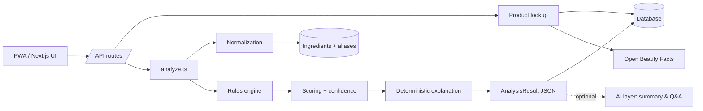

# COMIGO

**A deterministic, explainable compatibility engine for cosmetics — not another "toxic ingredient" scanner.**

[](https://nextjs.org/)
[](https://www.typescriptlang.org/)
[](https://www.prisma.io/)
[](https://vitest.dev/)
[](#)

Scan a cosmetic product and get a **personal compatibility score** — for *your* skin type, sensitivities, concerns and personal exclusion list — with the reasons, the evidence, and the uncertainty made explicit. No LLM ever touches the score; AI is an optional layer that explains a result the domain engine already computed deterministically.

> This README is written for engineers and recruiters evaluating my work. Product docs (in Portuguese, since the product ships in Brazilian Portuguese) are linked at the [bottom](#product--architecture-docs).

---

## Why this project exists

Most "ingredient checker" apps hand out a single universal score ("safe" / "toxic") that ignores the fact that compatibility is personal, and hides how confident that number actually is. That's the product bet here, taken as an engineering constraint, not a slogan:

> We never say a cosmetic is simply "good" or "bad." We estimate how compatible it is with *this* person, explain why, and make the evidence level and uncertainty visible.

Building that honestly — instead of faking it with a chatbot — is what makes this a useful engineering sample. A few examples of how the constraint shaped the code:

- **The score is 100% deterministic.** No LLM is in the scoring, verdict, confidence, or compatibility path (`src/domain`). AI only narrates an already-computed `AnalysisResult`, with a non-AI fallback so the product fully works with zero API keys.
- **Uncertainty is a first-class output, not an afterthought.** An unrecognized ingredient lowers confidence — it's never silently treated as absent. Below a coverage threshold, the verdict flips to a neutral "insufficient data" state instead of showing a confident colored badge on a half-read label. (That rule exists because a real Open Beauty Facts product with 5 of 31 ingredients recognized was originally scored "🟢 Excellent 85" — a bug in the *product's own principle*, caught with real data.)
- **Every score is auditable.** Each rule contributes a typed, signed line item (`ScoreContribution`) — dimension, points, reason, rule code, evidence — and `Σ contributions === final score` is a tested invariant, not a hope.
- **Rules and weights are versioned data, not code.** They live in a zod-validated JSON config, editable from an admin panel without a deploy, with a schema that prevents an invalid ruleset from ever reaching production.

---

## Engineering highlights (for reviewers in a hurry)

| Area | What's there |
|---|---|
| **Domain-driven boundaries** | `src/app → src/server → src/domain`, enforced by convention and reviewed on every change. `src/domain` is pure TypeScript — no Next.js, no Prisma, no network, no AI SDK — so the entire scoring engine is unit-testable and portable (could run offline, in a worker, on-device). |
| **Rules engine as data** | Compatibility rules are declarative JSON (condition → effect → evidence level), validated with Zod, versioned in the database. Adding a new rule is a config change, not a code change. |
| **Confidence modeling** | Ingredient-recognition confidence, source reliability, and formula coverage are combined into a `high / medium / low` confidence signal that gates how strongly the UI can present a result. |
| **Adapter pattern for ingestion** | A single `ProductSource` interface backs the local catalog and the Open Beauty Facts API today; adding a manufacturer feed or retailer CSV is a new adapter, nothing else changes. |
| **Multi-provider AI, gracefully degraded** | Anthropic (Claude) for grounded Q&A/summaries over the analysis JSON, Google Gemini for photo-based product identification, and an OpenAI/Gemini fallback chain for web ingredient lookups when the local database misses — each with a deterministic fallback path if the provider or key is unavailable. |
| **Cache correctness** | Analyses are cached by `(productId, product.updatedAt, profileHash, rulesetHash, engineVersion)` — change the rules, the profile, or the engine, and the cache key changes with it. No stale scores after a ruleset edit. |
| **Migration discipline** | Any change to normalization or default rules bumps `ENGINE_VERSION` (`src/domain/analyze.ts`), invalidating cached analyses and forcing a re-score. Enforced as a project rule, not just a comment. |
| **Regulated-language discipline** | A hard rule against words like "toxic," "poison," "carcinogenic," "cure" anywhere in generated or template text — probabilistic, contextual language only, with a standing prompt to see a professional for allergic reactions. |

---

## Built with AI as a disciplined engineering partner

I use Claude Code, Cursor, and ChatGPT daily in production work, but this repo is where I could set the rules of engagement myself — worth a look if you're evaluating how I actually work *with* an AI agent, not just whether I can type a prompt:

- A [`CLAUDE.md`](CLAUDE.md) at the repo root acts as a standing brief for any AI agent working in this codebase: the product's non-negotiable principle, the module boundary (`app → server → domain`), when to update `ENGINE_VERSION`, banned language, and — critically — **"if a request conflicts with this, question it before implementing."**
- **Docs before code.** Product decisions live in [`docs/01`–`05`](docs/) and are written *before* the corresponding implementation, so an agent (or a teammate) has a decision record to build against instead of reverse-engineering intent from a diff.
- **Determinism is enforced, not assumed.** The rule "no LLM in the scoring path" is written into the agent's operating instructions and checked in review — the kind of guardrail that matters more, not less, once an AI is writing some of the code.
- Small-scale exploration of agent-facing infrastructure beyond this repo: a proof-of-concept **read-only MCP server** exposing structured feature-flag/business-rule knowledge to AI assistants, described on my [resume](#contact).

---

## Architecture

Single Next.js deployment (App Router + TypeScript) — a modular monolith. Microservices aren't earned yet; what protects the codebase from turning into one anyway is the **module boundary**, not the network:

```
src/
  domain/            Pure TypeScript. No Next.js, no Prisma, no AI SDK. Fully unit-tested.
    normalization/   raw INCI text → tokens → canonical ingredient (+ match confidence)
    rules/           data-driven rule evaluation
    scoring/         dimensions, weights, hard blockers, confidence, verdict
    explain/         deterministic explanation text
    analyze.ts       orchestrates: product + ingredients + profile + config → AnalysisResult
    config/          default rules/weights (JSON) + Zod schema
  server/            infrastructure adapters
    repositories/    products, ingredients, profile, analyses
    sources/         external source adapters (local catalog, Open Beauty Facts)
    services/        use cases (analyze by barcode, analyze pasted text, compare, alternatives)
    ai/              optional explanation/Q&A/vision layer, provider-agnostic
  app/               Next.js pages + /api routes
  components/        UI (shadcn/ui + Tailwind)
prisma/              schema + seed (134 ingredients, 16 fictional demo products)
```



### How a score is built

```
Data → Normalization → Rules → Analysis → Score → (AI explains, never decides)
```

- 4 weighted dimensions: personal preferences, skin-type fit, benefits for stated concerns, general attention points.
- A strict "won't use" ingredient triggers a hard conflict and caps the score; "prefer to avoid" only penalizes.
- Unrecognized ingredients never penalize the score — they lower confidence instead.
- Rules and weights are versioned data, editable from `/admin/regras` without a deploy.

---

## Tech stack

| Layer | Choices |
|---|---|
| **Language** | TypeScript (strict), pure-function domain core |
| **Frontend** | Next.js 15 (App Router, RSC), React 19, Tailwind CSS, shadcn/ui |
| **Backend** | Next.js API routes, Prisma ORM |
| **Database** | SQLite (dev) → Postgres (Supabase) in production |
| **AI (optional layer)** | Anthropic Claude (explanation/Q&A), Google Gemini (vision + search fallback), OpenAI (search fallback) |
| **PWA** | Web app manifest, service worker, installable, camera-based barcode scanning (`BarcodeDetector` + `@zxing/browser` fallback) |
| **Testing** | Vitest — domain invariants (e.g. `Σ score contributions === final score`) are tested directly |
| **Validation** | Zod schemas at every boundary (rules config, API input, ingestion) |

---

## Getting started

Requires Node 20+.

```bash
npm install
cp .env.example .env
npm run setup   # prisma db push + seed (134 ingredients, 16 fictional demo products)
npm run dev
```

Open http://localhost:3000. Admin panel at `/admin` (user `admin`, password from `ADMIN_PASSWORD`). The app runs fully **without any AI API key** — AI features degrade to deterministic fallbacks.

```bash
npm test          # vitest — domain engine tests
npx tsc --noEmit  # type check
```

---

## Known limitations (stated on purpose)

Being upfront about scope is part of the "visible uncertainty" principle applied to the project itself:

- The ingredient database is an initial curation and needs expert review before any real production claim.
- Demo products are entirely fictional; products pulled from Open Beauty Facts land in a "pending review" queue, never shown as verified.
- Ingredient concentration isn't on the label — list position is used as an approximation.
- Profile is anonymous per-device (no cross-device sync yet).

---

## Product & architecture docs

Deeper product reasoning, written in Brazilian Portuguese (the product's shipping language) *before* implementation, per this repo's own engineering rules:

| Step | Doc |
|---|---|
| 1. Critical analysis (risks, science, UX, out-of-scope) | [docs/01-analise-critica.md](docs/01-analise-critica.md) |
| 2. Competitors & differentiation | [docs/02-concorrentes.md](docs/02-concorrentes.md) |
| 3. MVP scope (MUST / SHOULD / LATER / OUT) | [docs/03-mvp.md](docs/03-mvp.md) |
| 4. Data model | [docs/04-modelo-de-dados.md](docs/04-modelo-de-dados.md) |
| 5. Architecture, rules & scoring | [docs/05-arquitetura.md](docs/05-arquitetura.md) |
| — | Agent operating rules: [CLAUDE.md](CLAUDE.md) |

---

## Contact

**Bruno Rodrigues** — Senior Software Engineer (Node.js · TypeScript · AWS · AI-assisted engineering)
[LinkedIn](https://linkedin.com/in/brnbruno) · [GitHub](https://github.com/BrunoRodriguesNasc) · brunorodrinasc@gmail.com
