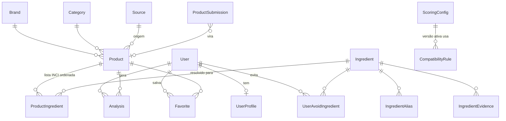

# Passo 4 — Modelo de dados

Implementação: [`prisma/schema.prisma`](../prisma/schema.prisma). SQLite em desenvolvimento, Postgres em produção (troca de `provider`). Campos "lista" usam `Json` para funcionar nos dois bancos.

## Entidades

### User / UserProfile
- `User`: anônimo (id em cookie httpOnly). `consentAt` registra consentimento LGPD para dados sensíveis.
- `UserProfile`: `skinType` (`oily|dry|combination|normal|unknown`), `sensitive` (`true|false|null` = não sei — **eixo separado do tipo**, porque pele oleosa pode ser sensível), `concerns: string[]`, `preferences: {key, strictness}[]`, `version` (incrementa a cada edição; entra no hash da análise).

### Preference (valor, não tabela)
Chaves fechadas definidas na configuração (`avoid_fragrance`, `avoid_essential_oils`, `avoid_drying_alcohol`, `simple_formula`, `vegan`, `cruelty_free`). `strictness`: `strict` (conflito/bloqueio) ou `soft` (penalidade). Guardar como JSON evita tabela para algo pequeno e sem consulta por chave.

### UserAvoidIngredient
Lista pessoal por ingrediente canônico, com `strictness`. É relacional porque precisa de busca/join e porque o alias resolve para o canônico (quem evita "Parfum" também evita "Fragrance").

### Brand, Category, Source
- `Category` com `parentId` (ex.: `rosto > base`). Usada para alternativas.
- `Source`: `key` (`manual`, `openbeautyfacts`, `user_submission`, `bulk_import`), `license`, `trustLevel` (0–1, entra na confiança). **Múltiplas fontes desde o dia 1.**

### Product
`barcode` (único, opcional para produtos sem EAN), `brandId`, `name`, `categoryId`, `subcategory`, `description`, `imageUrl`, `ingredientsRaw` (texto original preservado), `country`, `sourceId`, `sourceUrl`, `externalId`, `reviewStatus` (`pending|verified|rejected`), `verifiedAt`, `attributes` (JSON: `vegan`, `crueltyFree`, `finish`… sempre *declarado pela marca*, com `null` = não informado), `createdAt`, `updatedAt`.

### ProductIngredient (a lista normalizada)
`productId`, `position` (ordem do rótulo — importa para concentração), `rawName` (como veio), `normalized`, `ingredientId?`, `matchType` (`exact|alias|fuzzy|unmatched`), `matchConfidence` (0–1).
Guardar a normalização persistida permite: auditoria, reprocessar quando a base melhora, e revisão manual de matches fuzzy.

### Ingredient
`inciName` (canônico), `slug`, `displayNamePt`, `summaryPt` (explicação simples), `functions: string[]` (função cosmética, vocabulário CosIng), `benefitTags: string[]`, `concerns: {tag, level, evidence, note}[]`, `flags: string[]` (`fragrance`, `essential_oil`, `drying_alcohol`, `fatty_alcohol`, `eu_declarable_allergen`, `exfoliant_aha`, `exfoliant_bha`, `retinoid`, …), `comedogenicNote?`, `evidenceLevel`, `reviewStatus`.

Separação deliberada:
- **função** = o que faz na fórmula (emoliente, conservante);
- **benefício** = efeito potencial na pele (hidratação);
- **concern** = ponto de atenção com *nível* e *força de evidência*;
- **flag** = categoria objetiva usada por preferências (é/não é fragrância).

### IngredientAlias
`alias`, `normalized` (único; minúsculas, sem acento, espaços colapsados), `kind` (`synonym|translation|inn|trade|typo`), `locale`. Ex.: `Nicotinamide`, `Vitamin B3`, `Niacinamida` → Niacinamide. Nem todo sinônimo popular deve virar alias (ex.: "Vitamin E" pode ser Tocopherol **ou** Tocopheryl Acetate — mapeado para o mais comum e marcado para revisão).

### IngredientEvidence
`ingredientId`, `claim` (tag de benefício/concern), `stance` (`supports|mixed|against`), `level`, `sourceTitle`, `sourceUrl`, `notes`. Dá rastreabilidade para cada afirmação importante.

### CompatibilityRule + ScoringConfig
- `CompatibilityRule`: `code`, `dimension`, `active`, `definition` (JSON validado: condições de perfil/ingrediente/produto → efeito). Ver [05-arquitetura.md](05-arquitetura.md#motor-de-regras).
- `ScoringConfig`: pesos, bases por dimensão, faixas de veredito, fatores de posição, limite de conflito, definição das preferências. Versionada; uma ativa.

### Analysis (e AnalysisResult)
`userId`, `productId?` (nulo para lista colada), `inputRaw?`, `engineVersion`, `rulesetHash`, `profileHash`, `score`, `verdict`, `confidence`, `result` (JSON).

**Decisão:** `AnalysisResult` não é tabela separada. O resultado é um documento imutável (snapshot) lido inteiro; normalizá-lo em linhas só aumentaria joins. As colunas desnormalizadas (`score`, `verdict`, `confidence`) servem histórico e listas. Os hashes permitem **cache** (mesmo produto + mesmo perfil + mesmas regras = mesma análise) e reprodutibilidade.

### Favorite, ProductSubmission, UnmatchedIngredient
- `Favorite(userId, productId)`.
- `ProductSubmission`: envio de usuário (EAN + nome + INCI colado) → fila de revisão → vira `Product`.
- `UnmatchedIngredient(normalized, sample, count, lastSeenAt)`: backlog editorial ordenado por frequência.
