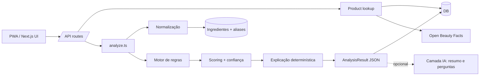

# Passo 5 — Arquitetura

## Decisão: monólito modular em Next.js

Um único deploy (Next.js App Router + TypeScript) contendo UI, API e domínio. Microservices não se pagam nesta fase. O que garante evolução é a **fronteira de módulos**, não a rede:

```
src/
  domain/            ← TypeScript puro. Sem Next, sem Prisma, sem IA. 100% testável.
    types.ts
    normalization/   raw INCI → tokens → ingrediente canônico (+ confiança)
    rules/           avaliação de regras data-driven
    scoring/         dimensões, pesos, bloqueios, confiança, veredito
    explain/         textos determinísticos em PT-BR
    analyze.ts       orquestra: produto + ingredientes + perfil + config → AnalysisResult
    config/          regras e pesos padrão (JSON) + schema zod
  server/            ← adaptadores de infraestrutura
    db.ts            Prisma client
    repositories/    produtos, ingredientes, perfil, análises
    sources/         adaptadores de fontes (local, Open Beauty Facts)
    services/        casos de uso (analisar por EAN, analisar texto, comparar, alternativas)
    ai/              camada de explicação/perguntas (opcional)
    session.ts       usuário anônimo por cookie
  app/               ← Next.js: páginas e rotas /api
  components/        ← UI
```

Regra de dependência: `app → server → domain`. O domínio nunca importa infraestrutura. Se um dia o motor precisar rodar em outro lugar (mobile offline, worker), ele já é portável.



## Frontend
- Next.js App Router, React Server Components para páginas de leitura; Client Components só onde há interação (scanner, onboarding, perguntas).
- Tailwind CSS. Mobile-first; layout máx. ~480px centralizado em telas grandes (é um app de bolso), com páginas admin em largura total.
- **PWA**: `manifest.webmanifest`, ícones, service worker simples (cache do app shell; API sempre rede). Sem cache offline de análises no MVP.

## Scanner
1. `BarcodeDetector` nativo (Chrome/Android) — rápido, sem custo.
2. Fallback `@zxing/browser` (iOS Safari, Firefox).
3. Digitação manual do código, sempre visível.
4. Não encontrado → colar lista de ingredientes (análise avulsa) → opcionalmente enviar para revisão.

Câmera exige HTTPS (em dev no celular: túnel ou `next dev --experimental-https`).

## Ingestion
Interface única para qualquer fonte:

```ts
interface ProductSource {
  key: string;                                  // 'openbeautyfacts'
  lookupByBarcode(barcode: string): Promise<ExternalProduct | null>;
}
```

- `LocalCatalogSource` (banco), `OpenBeautyFactsSource` (API pública, dados ODbL).
- Resultado externo é **persistido** como `Product` com `reviewStatus = pending` e `source` correspondente → vira cache e entra na fila de revisão.
- Importação em lote (JSON) no admin usa o mesmo pipeline `upsertProductWithIngredients`, que **sempre** re-normaliza o INCI.
- Novas fontes (CSV de fabricante, parceiro varejista) = novo adaptador, nada mais muda.

## Normalização
```
"Aqua (Water), Glycerin, Nicotinamide*, Parfum/Fragrance, Cl 77891"
  → split respeitando parênteses ("Aqua (Water)" é um item)
  → remove marcadores (*, "may contain", "+/-", "ingredientes:", "%")
  → normaliza (minúsculas, sem acento, espaços, "cl"→"ci" em colorantes)
  → match: exato no INCI → alias → alternativas "A/B" e "A (B)" → fuzzy (Levenshtein ≤ limiar proporcional)
  → { position, rawName, ingredientId?, matchType, matchConfidence }
```
Fuzzy nunca é silencioso: confiança < 1 e aparece no modo detalhado. Não reconhecidos alimentam `UnmatchedIngredient`.

## Motor de regras

Regras são **dados** (JSON validado com zod), editáveis no admin:

```json
{
  "code": "sensitive_fragrance",
  "dimension": "profile_fit",
  "when": {
    "profile": { "sensitive": true },
    "ingredient": { "flagsAny": ["fragrance"] }
  },
  "effect": {
    "kind": "attention",
    "points": -15,
    "aggregate": "max",
    "positionScaling": false,
    "message": "Contém {ingredients}. Fragrâncias podem causar irritação ou sensibilização em algumas pessoas, principalmente em pele sensível."
  },
  "evidence": "high"
}
```

- Condições de **perfil**: `skinTypesAny`, `concernsAny`, `sensitive`.
- Condições de **ingrediente**: `flagsAny`, `benefitTagsAny`, `concernTagsAny`, `functionsAny`.
- Condições de **produto**: `attributeEquals` (ex.: `finish = matte`), `categoryAny`.
- Efeito: `kind` (`positive|attention|info`), `points`, `aggregate` (`max` = conta uma vez com o melhor ingrediente; `sum` = soma limitada por `maxPoints`), `positionScaling`.
- **Preferências e lista pessoal** não são regras editáveis: são tratadas pelo módulo de preferências, porque sua semântica (estrito = conflito) é fixa e crítica.

## Scoring (explicável por construção)

Dimensões (ver `src/domain/config/default-config.ts`):

| Dimensão | O que mede | Base | Peso padrão |
|---|---|---|---|
| `preferences` | respeito às preferências e à lista pessoal | 100 | 0.30 |
| `profile_fit` | adequação ao tipo de pele / sensibilidade | 70 | 0.30 |
| `benefits` | ingredientes com funções desejáveis para as preocupações | 40 | 0.25 |
| `general` | pontos de atenção gerais (independentes de perfil) | 100 | 0.15 |

Por que essas dimensões: separam *o que a pessoa pediu* (preferências), *o que a pele dela tende a tolerar* (perfil), *o que ela busca* (benefícios) e *o que vale para qualquer um* (geral). Pesos são um ponto de partida — ajustáveis sem deploy — e devem ser calibrados com feedback real (ex.: "concordo/não concordo com essa nota").

```
subscore_d = clamp(base_d + Σ pontos das regras da dimensão d, 0, 100)
score      = Σ peso_d × subscore_d
se houver conflito estrito: score = min(score, limite_conflito)  e veredito = "conflict"
```

Toda parcela vira uma linha `ScoreContribution { dimension, points(no score final), reason, ruleCode, ingredients }`, incluindo **base**, **ajuste de limite (clamp)**, **limite de conflito** e **arredondamento**. Invariante testado: `Σ contribuições = score`.

**Fatores**:
- posição (1–5: 1.0 · 6–10: 0.85 · 11–20: 0.6 · >20: 0.4) aplicado a benefícios e a atenções dose-dependentes;
- evidência: regras com evidência baixa têm peso reduzido e texto "evidência limitada".

**Confiança** (`high|medium|low`): cobertura ponderada por posição dos ingredientes reconhecidos (fuzzy conta pela sua confiança) × confiabilidade da fonte × status de verificação. Cobertura < 50% ⇒ `partial = true` e o veredito é exibido como "análise parcial".

**Vereditos**: `excellent ≥ 85`, `good ≥ 70`, `caution ≥ 50`, `poor < 50`, `conflict` (qualquer conflito estrito) e `insufficient` (análise parcial sem conflito).

> Decisão tomada após teste com dados reais do Open Beauty Facts: um produto com rótulo em português teve só 5 de 31 ingredientes reconhecidos e aparecia como "🟢 EXCELENTE 85". Um veredito colorido sobre 16% da fórmula viola o princípio do produto. Agora, abaixo da cobertura mínima, o veredito é neutro ("Dados insuficientes para avaliar"), a nota continua visível com esse contexto e os achados seguem listados. Um conflito estrito identificado continua sendo exibido como conflito, porque é informação real.

## Camada de IA

- **Nunca** calcula nota nem decide compatibilidade.
- Entrada: o `AnalysisResult` (JSON) + a pergunta. Instruções: responder só com base nos dados, dizer "não sei" quando não houver dado, sem alegações médicas, PT-BR simples.
- Usos: (1) resumo personalizado sob demanda; (2) perguntas sobre o produto.
- Fallback sem chave de API: resumo determinístico + resposta por correspondência de palavras-chave às seções da análise.
- Modelo configurável (`AI_MODEL`, padrão `claude-opus-5`), esforço baixo (tarefa de redação curta), fallback de servidor habilitado para recusas.
- Futuro: interpretar ingredientes desconhecidos **como sugestão para o admin revisar**, nunca direto na análise.

## APIs

| Método | Rota | Uso |
|---|---|---|
| GET/PUT | `/api/profile` | ler/salvar perfil (+ consentimento) |
| DELETE | `/api/profile` | apagar todos os dados do usuário |
| GET | `/api/ingredients/search?q=` | busca para a lista pessoal |
| POST | `/api/analyze/barcode` | `{barcode}` → lookup + análise |
| POST | `/api/analyze/text` | `{ingredients, name?}` → análise avulsa |
| POST | `/api/submissions` | enviar produto para revisão |
| GET | `/api/history` | histórico |
| POST/DELETE | `/api/favorites` | favoritos |
| POST | `/api/compare` | `{barcodes: [a,b]}` |
| POST | `/api/ask` | `{analysisId, question}` |
| * | `/api/admin/*` | CRUD admin (Basic Auth via middleware) |

## Cache
- Análise: chave `(productId, product.updatedAt, profileHash, rulesetHash, engineVersion)` → reutiliza `Analysis` existente.
- Lookup externo: produto persistido após a primeira consulta.
- Índice de ingredientes/aliases: carregado em memória por processo com invalidação por `updatedAt` máximo (barato: centenas/milhares de linhas).
- Resumo IA: guardado dentro da própria análise.

## Observabilidade (MVP)
- Logs estruturados JSON (`src/server/log.ts`) com eventos: `scan.lookup` (hit/miss/source), `analysis.created` (score, confiança, cobertura, ms), `ai.call` (tokens, ms, erro).
- Painel admin com: taxa de "não encontrado", ingredientes não reconhecidos mais frequentes, fila de revisão.
- Depois: OpenTelemetry + Sentry.

## Deploy e custo
- Vercel (ou Fly/Railway) + Postgres gerenciado (Neon/Supabase free tier). Custo inicial ≈ zero; IA só sob demanda.
- Trocar SQLite→Postgres: mudar `provider` e `DATABASE_URL`, rodar `prisma migrate`.

## Segurança e confiabilidade
- Admin por Basic Auth (`ADMIN_PASSWORD`) no MVP; contas/roles depois.
- Validação zod em todas as entradas. Limite de tamanho no texto de ingredientes.
- Disclaimers: fixo no resultado + contextual quando o perfil indica sensibilidade/alergia.
- Dados sensíveis: sem e-mail, consentimento explícito, exclusão total.
